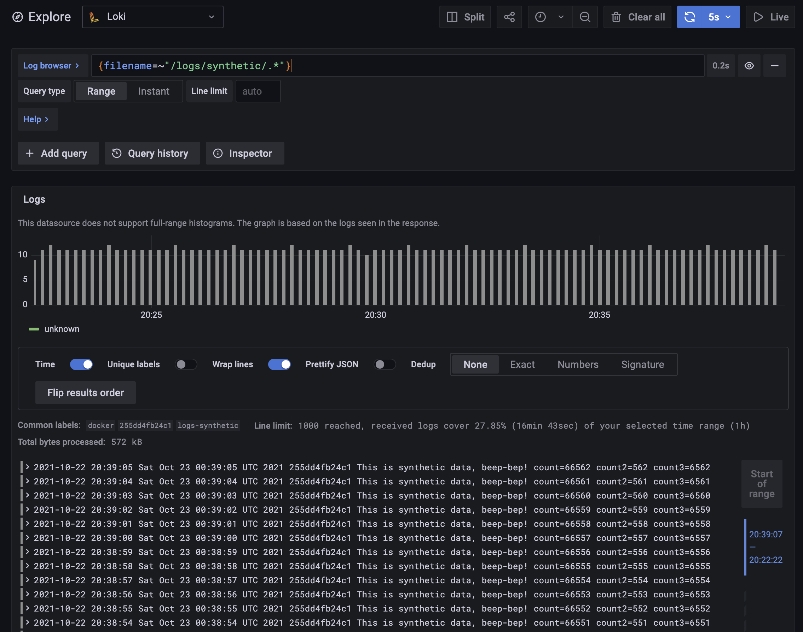

# Grafana Network Monitor

This project is an offshoot of my [Grafana Playground app](https://github.com/dmuth/grafana-playground)
that is specificlly build around monitoring ICMP connectivity to various hosts on the Internet.

The major pieces of this project are:

- Grafana, for graphing
- Loki, for storing time series logs
- `ping`, a container which pings multiple hosts
- A Docker container called `logs`, which automatically generates synthetic log entries.
- Promtail, for reading in the generated logs, output of `ping`, as well as the contents of `/var/log/`. All logs are sent off to loki.

## Getting Started

- `cp hosts.txt.sample hosts.txt` to set up your `hosts.txt` file
- Run `docker-compose up` to start up the environment.
- Go to http://localhost:3000/ and log into Grafana with login/pass of `admin/admin`.
- [Create an API with Admin access](http://localhost:3000/org/apikeys)
- Spawn a shell in the `tools` container and import the dashboards and data sources into Grafana
  - `docker-compose exec -e API_KEY=YOUR_API_KEY tools bash`
  - `/mnt/bin/manage-data-sources.py --api-key ${API_KEY}`
  - `cat /mnt/config/dashboards.json | /mnt/bin/manage-dashboards.py --import --api-key ${API_KEY}`
  - Type `exit` to exit the shell in that container
- At this point, your Data Source (Loki) and Dashboards have been loaded, with the latter available at http://localhost:3000/dashboards.

## List of Endpoints

- http://localhost:3000/ - Local Grafana instance. Login and pass are `admin/admin`.
- http://localhost:3100/ - Local Loki instance.  Check http://localhost:3100/ready to see if the instance is ready.
- http://localhost:9081/targets - Targets page for the (Dockerized) instance of promtail.

## Viewing Dashboards

### The Ping dashboard

Look, just start with the ping dashboard, okay?

- [Ping Results](http://localhost:3000/d/WiThvuS7z/ping-results) - Shows ping time and packet loss for specified hosts.  The hosts can be changed.
  - Additionally, any hostname (as defined in `hosts.txt`) that starts with `internal-` will be excluded from the aggregate ping dashbaord.  This makes tracking Internet outages easier.
- [Ping Results - Internval vs External](http://localhost:3000/d/KfLZ8yvVk/ping-results-internal-vs-external) - 

Yeah, so you loaded the dashboard, and it's showing the results of pinging multiple hosts on the Internet (round-trip time and packet loss) on a dashboard that gets updated every 5 seconds!  Neat, huh?

## Pinging Additional Hosts

- Optionally edit the file `hosts.txt` to add human-readable names for IP addresses.
- Copy `docker-compose.override.yml.sample` to `docker-compose.override.yml`.
- Uncomment the `environment:` and `HOSTS:` keys.
- Add additional hosts or IPs into `HOSTS:` as you see fit.
- Restart the `ping` container with?:
  -  `docker-compose kill ping; docker-compose rm -f ping; docker-compose up -d ping`.
- Current hosts being pinged can be inspected with this command:
  - `docker inspect grafana-network-monitor-ping-1 | jq .[].Config.Env`

## Exporting Dashboards

- If you want to export your current set of dashboards (including any changes made) to disk, first you'll need launch a shell in the tools container:
  - `docker-compose exec tools bash`
- Now, using your API key, run the script to export dashboards into `dashboards.json` in the current directory:
  - `export API_KEY=YOUR_API_KEY`
  - `/mnt/bin/manage-dashboards.py --export --api-key ${API_KEY} > /mnt/dashboards.json`
  - If you get an HTTP 401 error, it means your API key was invalid.
- Exit the container and move the `dashboards.json` file into the `config/` directory:
  - `mv dashboards.json config/dashboards.json`

## Running Ad-hoc Queries

- To run a specific query, click the `Compass` on the left which puts you into `Explorer Mode`.
  - Then paste in this query: `{host=~".+"}`.
  - That should immediately show you the most recent logs that have been written. If this shows nothing, then data is not making it into Loki.

## Manually Injecting Logs

If you want to manually inject an arbitrary number of logs, that can be done with this command:

- `docker-compose run logs n`

Replace `n` with the number of logs you want to write.  They will go into the file `/logs/synthetic/manual.log`
in the `logs` volume, which will then be picked up by the `promtail` container.  They can be viewed
in Grafana with this query:

- `{filename=~"/logs/synthetic/manual.log"}`

## Command Line Utilities

If you want to query Loki directly, I write a command-line script for that:

- `./bin/query.sh` - Query the Dockerized instance of Loki on the command line.
  - Examples:
    - `./bin/query.sh '{job="logs-ping"}'`
    - `./bin/query.sh '{job="logs-ping"}' 5`
    - `./bin/query.sh '{job="logs-ping",host="docker"}'`
    - `./bin/query.sh '{job="logs-ping",filename="/logs/ping/google.com.log"}'`
    - `./bin/query.sh '{job="logs-ping",filename=~"/logs/ping.*"}'`
    - `./bin/query.sh '{job="logs-ping",filename=~"/logs/ping.*"}' 10`

## List of Docker Containers and Their Functions

- `ping` - Pings one or more hosts continuously and writes the results to logfiles in a Docker voluem
- `grafana` - Grafana instance.
- `logs` - Container to make fake logs for testing Loki.
- `loki` - Loki instance.
- `promtail` - Tails logs from various other containers, as well as `/var/log/` on the host filesystem.
- `tools` - Container to run tools from.  It normally does nothing, to make use of it run `docker-compose exec tools bash` to spawn a shell, at which point the rest of the environment can be talked to using the container name as hostname.

## FAQ: After rebuilding the containers, I see strange behavior in Grafana, such as "Frontend not running"

I've experienced this myself, and I haven't been able to reliably reproduce it, but a few things seem
to have helped:

- Removing/adding the data source for Loki in Grafana
- Going to the bottom of the configuration page for the Loki data source, and clicking "Save and Test"
- Editing each graph in Grafana, going into the query, and hitting "ctrl-enter" to resubmit the query.  Yes, that seems weird to me too.

I expect to update this section as I perform more troubleshooting over the life of this app.

## Additional Considerations

- For Loki, I set `min_ready_duration` to be 5 seconds so that the database is ready quicker.
  - I would not recommend this setting for production use.
- Loki is not configured to save logs to S3 or any other object store--everything is on the local disk.
- There are some label extractions in `config/promtail-config-docker.yaml` which are commented out.
  - Feel free to uncomment them if you want to expirment with labels, but be advised the number of streams is the *product* of how many different label values you can have, which can cause performance issues.  That is explained more [in this post](https://grafana.com/blog/2020/08/27/the-concise-guide-to-labels-in-loki/)
  - TL;DR If you go crazy with labels and try to Index a high-cardinality field, you're gonna have a bad time!

## Frequently Asked Questions (FAQ)

#### Q: How are you pinging multiple hosts in the `ping` container? Are you running multiple copies of `ping`?

A: Yes, I am.  I used the excellent [Daemontools package](https://cr.yp.to/daemontools.html) to a separate service for each host that is being pinged.  Daemontools handles restarting of ping when it exits in a safe and sane way.

#### Q: But why multiple processes in a single container?  That's not a best practice in Docker!

A: It was a judgement call, I felt that if I was pinging say, 10 different hosts, having 10 different containers all doing the same function would be a little unwieldly.  Instead, it made more sense to me to keep all of that functionality under a single container.

#### Q: I see you're getting packet loss stats every 10 seconds.  What about the overhead in stopping and starting a `ping` process every 10 seconds?

A: That's not an issue, because I don't do that. :-)  Instead, [I hacked the ping utility](https://github.com/dmuth/iputils), and added in some code to print out the number of packets sent/received every 10 seconds.  I used this technique before for [my Splunk network health app](https://github.com/dmuth/splunk-network-health-check) and it works quite well.

A2: The previous answer was back from when I was sending my logs to Prometheus, the ingestion script I used competed a packet loss value.  Now that I'm sending my logs to Loki instead, my Loki query itself creates the packet loss value and all the raw data for each packet is logged.

## Development

- Working on the `logs` container
  - `docker-compose kill logs; docker-compose rm -f logs; docker-compose build logs && docker-compose up logs`
- Working on the `promtail` container
  - `docker-compose kill promtail; docker-compose rm -f promtail; docker-compose build promtail && docker-compose up promtail`
- Updating Dashboards
  - See the `Exporting Dashboards` and `Getting Started` sections above

## Credits

- [This blog post](https://avleonov.com/2020/06/10/how-to-list-create-update-and-delete-grafana-dashboards-via-api/) by Alexander V. Leonov that talks about how to use the Grafana API.
- [Telegraf & Prometheus Swiss Army Knife for Metrics](https://blog.nobugware.com/post/2016/telegraf_prometheus_metrics_swiss_army_knife/) - by Fabrice Aneche that helped me get started with Telegraf and reading the data from Prometheus.
- [Prometheus Metrics and Instrumentation](https://sysdig.com/blog/prometheus-metrics/) - I learned how to build a Python-based webserver to export metrics to Prometheus with this post.
- [prometheus-client module for Python](https://github.com/prometheus/client_python)
- [How Does a Prometheus Summary Work?](https://www.robustperception.io/how-does-a-prometheus-summary-work)

## Get In Touch

If you run into any problems, feel free to [open an issue](https://github.com/dmuth/grafana-network-monitor/issues)

Otherwise, you can find me [on Twitter](https://twitter.com/dmuth), [Facebook](https://facebook.com/dmuth), or drop me an email: **doug.muth AT gmail DOT com**.

